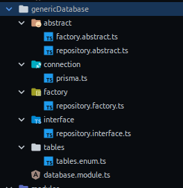

<h2 align="center">Creating a generic repository with nestjs and prisma</h3>
<h1 align="center">:hammer:</h3>


<h3 align="center">This project follows some concepts of OOP, (object oriented programming). 
This project was developed based on my knowledge in architecture and good programming practices.
</h3>



**Utility:**
The idea of this pattern is not to repeat logics several times or create
repositories "on top of others", in favor of **DRY**. 

* **DRY** : it is a
  programming concept which proposes that each piece of knowledge in a system must have a representation
  only.

example :
```javascript
    _create<Query = T>(data: Query): Promise<void | Query> {
        return this.ORM[this.table].create({ data });
    }
```


**ORM:** With this pattern we can easily change ORM without having to rewrite all our repositories.
application.

example:

```javascript
    constructor(table: TablesEnum, ORM: PrismaService) {
        this.table = table;
        this.ORM = ORM;
    }
```

<h3 align="center">Abstract repository</h3>

**AbstractRepositorty:** We abstract the common methods into a single file and then extend our abstract class
repository.

example: 


```javascript
    export abstract class RepositoryAbstract<T> implements IRepository<T> {
      private readonly table: TablesEnum;
      private readonly ORM: PrismaService;
    
      constructor(table: TablesEnum, ORM: PrismaService) {
        this.table = table;
        this.ORM = ORM;
      }
    
      _create<Query = T>(data: Query): Promise<void | Query> {
        return this.ORM[this.table].create({ data });
      }
    
      _delete<Query = number>(where: Query): Promise<boolean | void | Query> {
        return this.ORM[this.table].delete({ where });
      }
    
      _exists<Query = Partial<T>>(where: Query): Promise<boolean | Query> {
        return this.ORM[this.table].findFirst({ where });
      }
    
      _findAll<Query>(select?: Query): Promise<any> {
        if (!select) {
          return this.ORM[this.table].findMany();
        }
        return this.ORM[this.table].findMany({
          select,
        });
      }
    
      _findById<Query = number>(id: Query): Promise<void | T> {
        return this.ORM[this.table].findUnique({
          where: {
            id: id,
          },
        });
      }
    }
```
<h4 align="center">Concrete repository</h4>

Our adapter.

```javascript
    export abstract class userRepositoryAdapter extends RepositoryAbstract<IUSER> {}
```

Our concrete repository that extends from our adapter.

```javascript
    import { userRepositoryAdapter } from './adapter/userRepository.adapter';
    import { TablesEnum } from '../../../genericDatabase/tables/tables.enum';
    import { PrismaService } from '../../../genericDatabase/connection/prisma';
    import { Injectable } from '@nestjs/common';
    
    @Injectable()
    export class UserRepository extends userRepositoryAdapter {
      constructor(private prisma: PrismaService) {
        super(TablesEnum.USER, prisma);
      }
        ...metodos personalizados da nossa entidade ficariam aqui.
        ...our entity's custom methods would be here.
    }
```


<h4 align="center">Repositories factory</h4>

This is our **abstract factory**. All repositories are started here with the help of the **OnApplicationBootstrap** method.

```javascript
    import { FactoryAbstract } from '../abstract/factory.abstract';
    import { userRepositoryAdapter } from '../../modules/user/repository/adapter/userRepository.adapter';
    import { Injectable, OnApplicationBootstrap } from '@nestjs/common';
    
    /**
     * this class is responsible for creating a factory of repositories and starting them when the
     * application starts.
     * Here I install all the repositories of my project, centralizing them all
     *
     * @example
     * constructor(private repository: FactoryAbstract) {}
     */
    
    @Injectable()
    export class RepositoryFactory
      implements FactoryAbstract, OnApplicationBootstrap
    {
      _USER: userRepositoryAdapter;
      _ADDRESS: addressRepositoryAdapter;
      _STATE: stateRepositoryAdapter
    
      constructor(
          private userRepositoryConcrete: userRepositoryAdapter,
          private addressRepositoryAdapter: addressRepositoryAdapter,
          private stateRepositoryAdapter: stateRepositoryAdapter
    ) {}
    
      onApplicationBootstrap(): any {
        this._USER = this.userRepositoryConcrete;
        this._ADDRESS: this.addressRepositoryAdapter;
        this._STATE: this.stateRepositoryAdapter
      }
    }

```

<h3 align="center">Concrete instance of our repository</h3>

Using our repository in a concrete class to persist the data.
```javascript
  constructor(private repository: FactoryAbstract) {}
  async execute(request: CreateUserDto): Promise<any> {
    const isAlready = await this.repository._USER._exists<whererOR<IUSER>>({
      OR: [{ email: request.email }, { first_name: request.first_name }],
    });
``